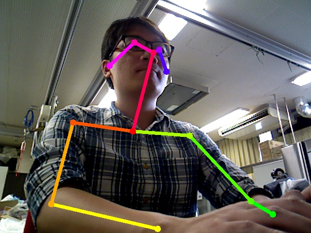

ROS package for [**OpenPose**](https://github.com/CMU-Perceptual-Computing-Lab/openpose)

============================

## Usage
 - [**Build openpose**](https://github.com/CMU-Perceptual-Computing-Lab/openpose#installation-reinstallation-and-uninstallation)
 - Catkin b [**openpose_ros_msgs**](https://github.com/bajsk/openpose_ros_msgs)
 - Catkin b openpose_ros
 - Run launch file with `roslaunch openpose_ros openpose_ros.launch`
 - Output topic
   + Debug Image: /openpose_ros/debug_img
   

    
   

   
   + Skeleton Information: /openpose_ros/skeleton
